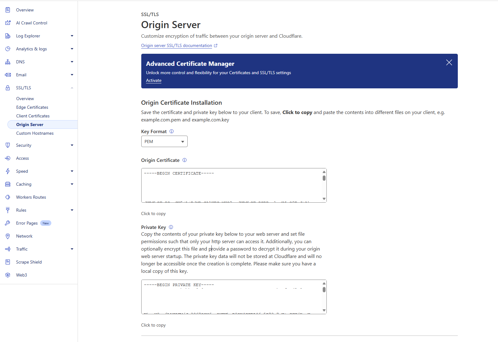
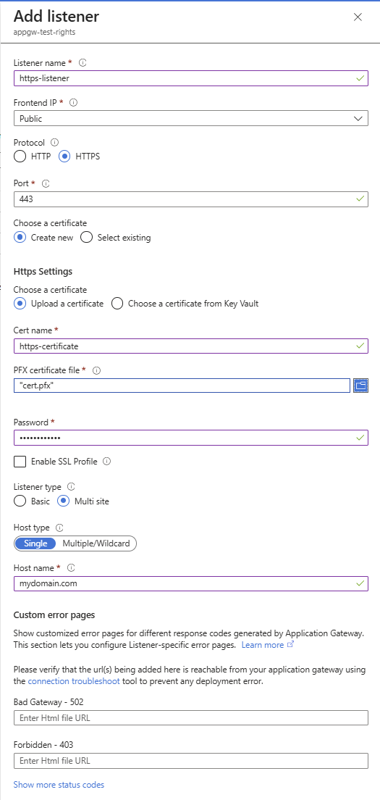
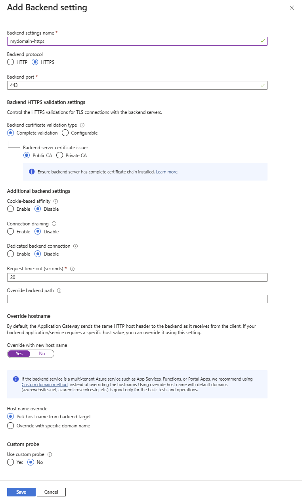
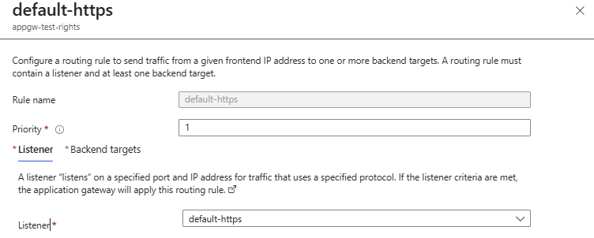
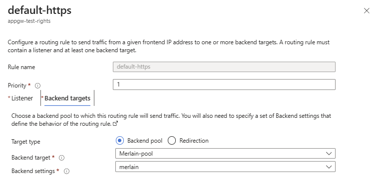

# Initial Steps :

## Generate a pfx certificate :

From a public DNS Registrar (like Cloudflare), create an Origin Certificate and download the necessary informations :

- While generating the certificate, copy the content of the PEM certificate in a file named cert.pem
- Copy the private key in a file named private.key :
- 
- Once done, execute the following command to transform both keys and certificate into a PFX file :
  ```bash
  openssl pkcs12 -export -out cert.pfx -inkey private.key -in certificate.pem
  ```
- This will generate a cert.pfx file, protected with a password manually added to the file

## Deploy the IaC

```bash
terraform init
terraform plan -o plan.out
terraform apply plan.out
```

[Blue Octopus - ACA Internal Mode](https://github.com/damienaicheh/blue-octopus/tree/main/catalog/aca-scenarios/internal-mode)

## Update the default listener to use the public certificate

In the Application Gateway resource, open the `Settings > Listener` panel and create an https listener as follows :


Then attach the listener to desired backend pool via a backend setting in the `Settings > Backend Settings` panel :

- Enable the Override with new host name and Pick host name from backend target to let the hosting service (Azure Container Apps, Azure App Service, etc.) provide with its own hostname/FQDN for continuous SSL Termination
  
- Bind Everything together via a Rule in the `Settings > Rules` panel :
- 
- 
